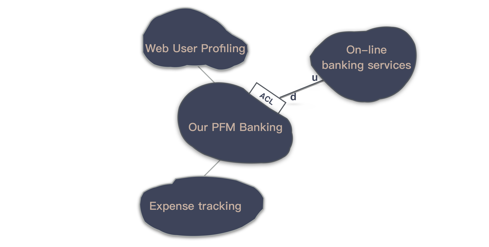

<!-- ---
date: "2019-06-23"
---   -->
      
# 答疑解惑 | 如何在实际工作中推行新观念？
你好，我是郑晔。

在整个专栏的最后一个大模块"综合运用"中，我们把前面学到的各种原则和知识穿插在一起应用在了不同的场景中。在这个模块的答疑中，我们也综合汇总一次，把整个专栏中出现的一些有趣却还没有来得及讨论的问题放在一起。

## 问题1：想要推行 DDD，阻力很大怎么办？

段启超 同学提到

> 想在公司内推行DDD，阻力真的很大，首先是很多人对DDD没概念，需要一定的学习成本，二是团队间相互隔离，沟通成本很高，起码的通用语言都很难达成。  
> ——《[37 | 先做好DDD再谈微服务吧，那只是一种部署形式](http://time.geekbang.org/column/article/89049)》

段启超同学提到的这个问题是一个非常典型的问题，而且，这个问题并不仅仅局限于 DDD。你在一个地方看到了一些好东西：技术、实践，或是想法，然后想把它运用在自己的项目中，希望项目越做越好，越来越顺利。但在实际情况中，想在一个组织内推广一些不一样的东西，都会面临层层阻力。

我在《[40 | 我们应该如何保持竞争力？](http://time.geekbang.org/column/article/90864)》中提到了一个学习模型，你只要在学习区不断地练习新技能，很快就可以超越同侪。其中的原因是，大部分人只习惯待在舒适区，在舒适区的人能力上的进步非常有限。也因为在舒适区实在太舒适了，走出舒适区会让人产生焦虑，所以，人的内心是惧怕改变的。

<!-- [[[read_end]]] -->

你有良好的愿望，驱动你自己去改变是一件可控的事，有愿意和你一起改变的人是一件幸运的事，但你指望所有人一下子和你走上同一条道路，这是一件几乎不可能的事，即便你是很高层的领导，让所有人与你保持一致也不现实。

我曾经在一个大公司做过敏捷咨询，这还是由他们顶层领导推动的敏捷转型，但依然是困难重重。那些习惯于待在自己舒适区的人总会找到各种神奇的理由告诉你，他们的情况有多么特殊，这些最佳实践在他们那里是不适用的。

我们放弃了吗？并没有。我们的做法是，找一个团队来做试点。

换句话说，我们找到了几个愿意改变的人，把这些最佳实践应用在他们的项目上。在这种情况下，大家的目标是一致的，就是希望让这个项目得到改善。所以，大家自然会想尽一切办法，克服遇到的困难。比如，我们当时的切入点是持续集成。

* 他们的代码都在老旧的 ClearCase 上，每个人修改文件要先去竞争文件锁，特别不利于小步提交，所以，我们推动着将 ClearCase 改成了稍微进步一点的 Subversion。（好吧，你能听出来这是一个有些年头的故事。）

* 代码是用 C 语言编写的，在他们的代码规模下，编译时间会很长。于是，我们决定搭建一个分布式构建系统，这需要有很多台电脑。不过，他们的硬件是严格管控的，申请电脑是很困难的，虽然花了很大的力气，但最终我们做到了。

* 以往团队都是几天甚至几周才提交一次代码，我们先将代码提交的要求限定在每人每天至少提交一次，为此，我们专门坐下来与团队成员一起分解任务，将他们理解的大任务拆分成一个一个的小任务。

* ……

想做事，只需要一个理由就够了，不想做，理由有一万个。劝那些不想改变的人改变是异常耗时而且收效甚微。最好的办法是，**找到愿意和你一起改变的人，做一件具体的事。**

我们并没有劝说谁去听从我们的想法，只是在一个一个地解决问题。我们花了很长时间，最终建立起了持续集成，看到大屏幕上的绿色标识，我颇为感动。原本只需要一两天搭建的持续集成，在一个复杂组织中，它要花费那么长时间，这也是我从未经历过的。

当我们把这件事做成之后，其他团队看到了效果，开始纷纷效仿。于是，原本复杂的各种规定也开始纷纷松绑，比如，他们再也不需要为申请电脑发愁了。至于之前质疑我们的人，因为看到了成效，他们的关注点就成了怎么把事能做成。

后来我听说，他们在组织内部专门建立了一个持续集成中心，为各个团队提供了公共的构建资源，提升了整体的效率。

Linus Torvalds 曾经说过：“Talk is cheap. Show me the code. ”讲道理很容易，但也难以让人真正的信服。同样，做事很难，但成果摆在那里，让人不得不信服。

在英文中对这种行为有一个说法叫“Lead by Example”，通常用来形容团队领导以身作则的行事风格。当你寻求改变时，无论你的角色是什么，你都需要扮演好领导者的角色，“Lead by Example”送给你！

## 问题2：测试怎么写？

andyXH 同学提到

> 目前对于 TDD 还是处于理解状态，不知道如何真正的在项目工程中使用。因为项目工程往往还有很多其他调用，如rpc，数据库服务，第三方服务，不知道在这个过程如何处理。期待老师在之后文章中讲解。  
> ——《[13 | 先写测试，就是测试驱动开发吗？](http://time.geekbang.org/column/article/78104)》

梦倚栏杆 同学提到

> 从数据库或者第三方api查询类内容需要写测试吗？这种测试怎么写呢？如果不需要写，会发现大量展示类系统不需要写测试了，感觉怪怪的。  
> ——《[16 | 为什么你的测试不够好？](http://time.geekbang.org/column/article/79494)》

闷骚程序员 同学提到

> 假设我要测试的函数是一个关于tcp的网络发送函数，我想问一下，老师在写类似这样功能的单元测试是怎么实现的？  
> ——《[39 | 面对遗留系统，你应该这样做](http://time.geekbang.org/column/article/90231)》

TimFruit 同学提到

> 问个问题，一般web服务依赖数据库，这部分如何做好单元测试？如果去掉数据库，很难测试相应的sql语句。  
> ——《[39 | 面对遗留系统，你应该这样做](http://time.geekbang.org/column/article/90231)》

大家看到了，这是一类非常典型的问题。一般来说，如果写的测试是一些业务逻辑的测试，大多数人还知道怎么测，一旦涉及到外部系统、数据库，很多人就不知道该怎么办了。

我们先来回答一个问题，你要测外部系统的什么？

你当然会说，我的整个系统都依赖于外部系统，没有了它，我的系统根本运行不起来，不能完成工作啊！但是，我的问题是你要测的是什么？

我知道很多人一想到外部系统，第一反应是：“我的整段代码都是依赖于外部系统的，因为外部系统不好测，所以，我这段代码都没法测了。”如果你是这样想的，说明你的代码将对外部系统的依赖在业务代码中散播开了，这是一种严重的耦合。**外部系统对你来说，应该只是一个接口。**

我在《[13 | 先写测试，就是测试驱动开发吗？](http://time.geekbang.org/column/article/78104)》中说过，想写好测试，先要站在可测试的角度思考。假设我同意你关于外部系统不好测的观点，那应该做的是尽量把能测的部分测好。将对外部系统的依赖控制在一个小的范围内。

一个好的做法就是设计一个接口，让业务代码依赖于这个接口，而第三方依赖都放在这个接口的一个具体实现中。我在《[34 | 你的代码是怎么变混乱的？](http://time.geekbang.org/column/article/87845)》中提到了 SOLID 原则，这种做法就是 **接口隔离原则（ISP）**的体现。


如果你能够站在系统集成的角度思考，这个部分就是系统与系统之间的集成点。我在《37 | 先做好DDD再谈微服务吧，那只是一种部署形式》提到了 DDD。在 DDD 的战略设计中，有一个概念叫上下文映射图（Context Map），在不同上下文中集成最常见的一种模式是防腐层（Anti-Corruption Layer，ACL）。



很多系统在实现时就是缺少了防腐层，造成的结果就是系统耦合极其严重。因为外部服务的任何修改都会造成自己的代码跟着大幅度变动，更极端的情况是，我见过一个网关系统在自己的业务逻辑中直接依赖于第三方服务传过来的 JSON 对象，造成内存资源的极大浪费，网关本身极其不稳定。

至此，你知道了，**如果有任何外部系统，都要设计防腐层，用接口做隔离。**这样，才能保证你的业务代码是可测的。如果外部系统真的不好测，这种做法将大幅度降低不可测的比例，尽可能提高测试覆盖率。

我们前面的假设是，外部系统不好测，但真的不好测吗？

作为 Moco 这个模拟服务器的作者，我肯定是不会同意这个说法。如果你的系统依赖的外部系统是最常见的 REST 服务，那 Moco 就是给这种场景准备的。我给你看一个最简单的[例子](http://github.com/dreamhead/moco/blob/master/moco-doc/usage.md#api-example)，这是 Moco 中最简单的用法：

```
    
    @Test
    public void should_response_as_expected() throws Exception {
        HttpServer server = httpServer(12306);
        server.response("foo");
    
        running(server, new Runnable() {
            @Override
            public void run() throws IOException {
                Content content = Request.Get("http://localhost:12306").execute().returnContent();
                assertThat(content.asString(), is("foo"));
            }
        });
    }
    
    

```

在这个例子里，你设置外部服务的行为，让它按照你的需求返回特定的内容，然后，运行你的服务去访问这个外部服务，它和你访问真实服务效果是一样的。而且，通过 Moco，你还可以模拟出一些真实服务不可能给你做出的效果，比如，连接超时。

这里给出的是一个用 Java 编写的例子。如果你采用的是其他语言，也可以使用 Moco 的 [Standalone](http://github.com/dreamhead/moco/blob/master/moco-doc/usage.md#standalone) 模式，用 JSON 配置出一个模拟服务器。

对于数据库的测试，如果你采用的是 [Spring Framework](http://spring.io/projects/spring-framework)，它就提供了一套完整的方案，比如：你可以在运行测试时插入一些数据，然后，在测试执行完毕之后，回滚回去，保证测试的可重复性。

事实上，它对测试的支持已经非常强大了，远不止于数据库。如果你采用的是 [Spring Boot](http://spring.io/projects/spring-boot)，对[测试的支持](http://docs.spring.io/spring-boot/docs/current/reference/html/boot-features-testing.html)就更加完整了，但基础还是 Spring Framework 提供的。如果用到真实的数据库，最好是一套独立的本地数据库，保证环境的可控。

对于外部服务的测试，简言之，**能模拟的就模拟，能本地的就本地。**如果你的服务没有现成的工具支持，也许就是一个打造新工具的好时机。

总结一下。**关于外部系统的测试，你可以先通过接口隔离开来，然后，通过模拟服务或本地可控的方式进行测试。**

好，今天的答疑就到这里，你对这些问题有什么看法呢？欢迎在留言区写下你的想法。

感谢阅读，如果你觉得这篇文章对你有帮助的话，也欢迎把它分享给你的朋友。