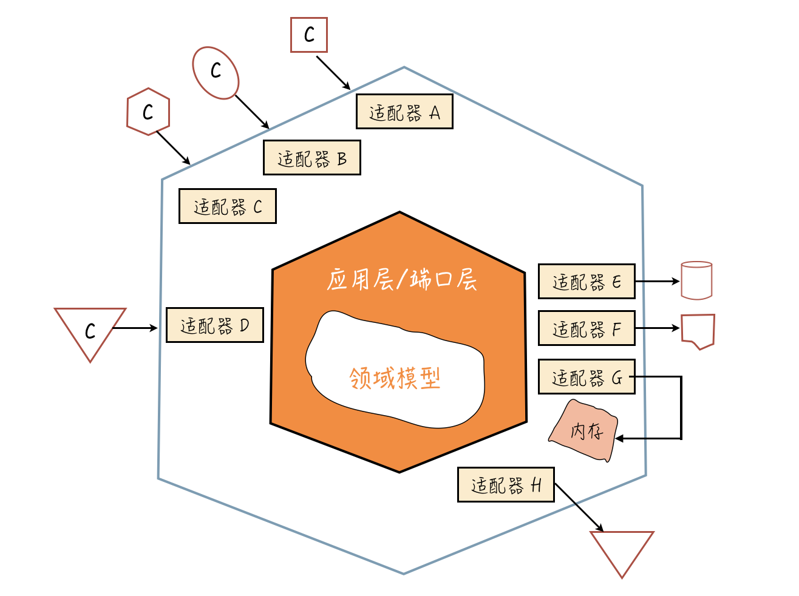

# 35 | 总是在说MVC分层架构，但你真的理解分层吗？

## 笔记

常见三层结构

* 数据访问层, 按照传统叫法是`DAO`, 按照领域驱动开发称之为`Repository`
* 服务层, 提供应用服务
* 资源层, 提供对外访问的资源 `Controller`

### 设计上的分解

**分层架构, 实际上, 就是一种在设计上的分解**

MVC 的概念起源于 GUI （Graphical User Interface，图形用户界面）编程，人们希望将图形界面上展示的部分（View）与 UI 的数据模型（Model）分开，它们之间的联动由 Controller 负责。这个概念在 GUI 编程中是没有问题的，但也仅限于在与 UI 有交互的部分。

很多人误以为这也适合服务端程序，他们就把模型部分误解成了数据库里的模型，甚至把它理解成数据库访问。于是，你会看到有人在 Controller 里访问数据库。

### 无处不在的分层

如`OSI`七层.

上层的使用者**可以忽略底层**, 真正的分层价值: **构建一个良好的抽象**.

编程语言也是一种抽象。

### 有抽象有发展

### 构建你的抽象

什么是核心模型呢？就是表达你业务的那部分代码，换句话说，别的东西都可以变，但这部分不能变。

关系型数据库不是你关注的核心. **不要面向数据库编程**

领域对象应该有业务逻辑.

**你的领域层只依赖于你的领域对象, 第三方发过来的内容先做一次转换, 转换成你的领域对象**, 这是**防腐层**.

### 总结

**构建好你的领域模型**

## 扩展